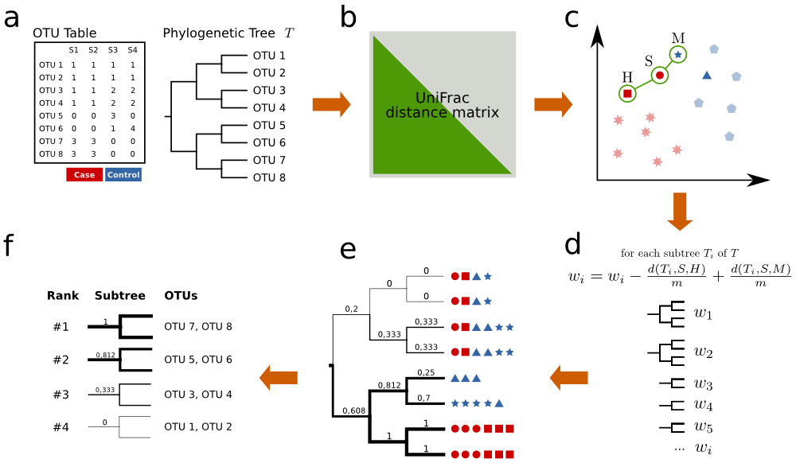

Algorithm Details
=================

      a) Preliminary analysis. From the sequences of the marker
      genomic loci selected by the experimental design, an OTU table
      and a phylogenetic tree of the representative sequences of the
      OTUs is computed. b) Next, the matrix of the distances between
      the samples must be computed using a phylogenetic measure of
      β-diversity, such as weighted or unweighted UniFrac must be
      provided.; c) The PhyloRelief strategy. Once one sample S has
      been randomly selected, the nearest hit :math:`H`, i.e. the
      nearest sample of the same class, and the nearest miss
      :math:`M`, i.e. the nearest sample of different class according
      to distance matrix :math:`D^S` are identified. d) The update
      function. For each branch :math:`T_i` the weight :math:`W[T_i]`
      is updated by summing the value :math:`d(T_i,S,H)/m` and
      subtracting :math:`d(T_i,S,M)/m`. The function
      :math:`d(T_i,A,B)` is computed by summing the UniFrac distance
      between the sample A and B restricted to the subtree
      :math:`T_i`. e) Correlation of the weights and definition of the
      clades. The weights of the each clades propagate to the parents,
      where it is either reinforced if coalescing with a clade sharing
      similar unbalance between the classes, or is diluted if
      coalescing with a clade with no or contrasting unbalance. This
      allows an iterative procedure leading to the the unambiguous
      identification of a set of uncorrelated clades. f) Output. The
      algorithm provides a list of clades of the phylogenetic tree
      ranked according to their contribution to the separation of the
      classes of samples.
